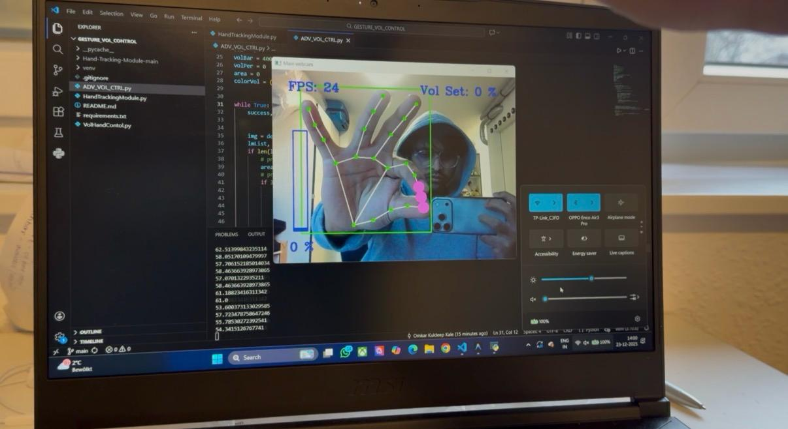
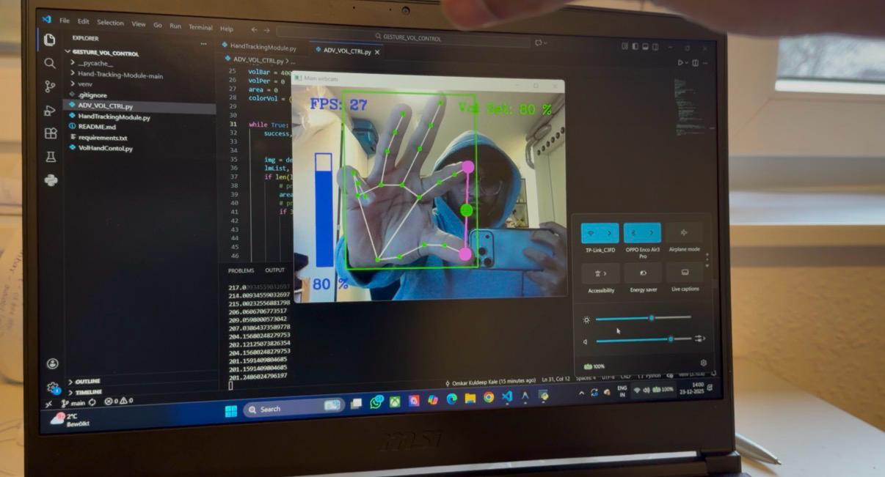

# 🖐️ Hand Gesture Volume Control


Control your system volume with **Minority Report-style** hand gestures! 🎚️✨

This project uses **Computer Vision** and **AI** to track your hand in real-time. simply pinch your fingers to adjust the volume. No mouse, no keyboard, just magic.

---

## 🚀 Features

*   **Real-time Hand Tracking:** Powered by Google's MediaPipe for lightning-fast detection.
*   **Intuitive Controls:** 
    *   **Pinch to Adjust:** Distance between thumb and index finger controls volume.
    *   **Visual Feedback:** Dynamic volume bars and percentage indicators.
    *   **FPS Counter:** Monitor performance in real-time.
*   **Smoothed Audio:** (Advanced Mode) Silky smooth volume transitions without jitter.
*   **Volume Lock:** (Advanced Mode) Flex your pinky to lock the volume level! 🔒

## 🛠️ Prerequisites

*   Python 3.7+
*   A Webcam

## 📦 Installation

1.  **Clone the Magic:**
    ```bash
    git clone https://github.com/Omkarkkale/Hand-gestures-Volume-control-using-Open-CV.git
    cd Hand-gestures-Volume-control-using-Open-CV
    ```

2.  **Install Dependencies:**
    ```bash
    pip install -r requirements.txt
    ```

## 🎮 How to Use

### 1. The "Pro" Controller (Recommended)
This version includes the fancy visuals, smoothing, and volume locking.

```bash
python ADV_VOL_CTRL.py
```

*   **Adjust Volume:** Pincher movement (Thumb ↔️ Index Finger).
*   **Lock Volume:** Fold your **Pinky Finger** down. The interface color changes to Green! 🟢
*   **Unlock:** Straighten your Pinky.

### 2. The "Basic" Controller
Simple, raw, effective.

```bash
python VolHandContol.py
```

## 🎥 Demo

Click the link below to watch the demo video:


> **GIF not loading?** [Watch the video here](https://github.com/Omkarkkale/Hand-gestures-Volume-control-using-Open-CV/raw/main/demo.mp4)

## 📸 Screenshots

<p align="center">
  
  
</p>

## 🧠 How it Works

1.  **Capture:** OpenCV grabs frames from your webcam.
2.  **Detect:** MediaPipe identifies 21 hand landmarks.
3.  **Calculate:** We measure the Euclidean distance between landmark 4 (Thumb Tip) and 8 (Index Tip).
4.  **Map:** This distance is mapped to your system's volume range using NumPy.
5.  **Control:** PyCaw interfaces with Windows Audio APIs to change the volume.

## 🤝 Contributing

Got an idea to make it cooler? Open an issue or submit a PR!

## 📜 License

Free to use for educational purposes!
